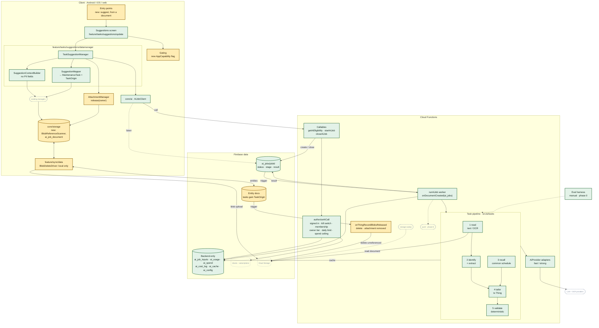

# Design Doc: Suggested Tasks from the Thing and Its Documents

**PRD:** [`task_population_PRD.md`](task_population_PRD.md)
**Epic:** [#1182](https://github.com/fz172/squawkit/issues/1182)
**Status:** 📋 Proposed
**Last updated:** 2026-09-27

> **Scope.** This doc also designs the **shared AI backend** (§5), because #1182 is the first AI
> epic to ship. §5 is written so it can be split out into `ai_backend_design.md` when #1181 starts;
> nothing in it names tasks except the pipeline registration.

---

## 1. Overview

Seven pieces, in dependency order. §15 sequences them and §18 breaks them into PRs.

1. **Evaluation harness** (§12). Runs the generation pipeline against a fixed case set with any
   provider adapter and scores it against PRD §9.4. The bake-off result is a follow-up PR that
   fills in §12.5.
2. **Shared AI backend** (§5). A job model: `startAiJob` callable → `ai_jobs/{jobId}` doc →
   Firestore-triggered worker → result on the same doc, which the client listens to. Provider
   abstraction, limits, kill switch, cost log.
3. **Reference-aware blob release** (§8.3). The client stops deleting remote blobs; a server
   trigger collects a blob when the last live record naming it drops it. Independent of AI; ships
   first.
4. **Task suggestion pipeline** (§6). Identify and extract per document, recall a common schedule
   for the identity, tailor to the Thing, then validate deterministically.
5. **Client data layer** (§7). `core/ai` (`AiJobClient`), `feature/tasks/suggestions` (context
   builder, mapper, manager).
6. **UI** (§9). The starter-pack screen becomes the suggestions screen; sources sheet, working,
   review, fallback, and gate states.
7. **Provenance** (§4.1). `TaskOrigin` on `MaintenanceTask`.

### 1.1 Component diagram

Green is new and amber is an existing piece this design changes. Existing, unchanged pieces are
shrunk to small dashed pills so the new work stands out. Solid edges are calls or writes, and
dotted edges are listeners, optional paths, or later phases. A zoomable version is on the
[artifact page](https://claude.ai/artifact/Rgp726o2ToowpcLocYkn9V).



Two paths cross the diagram:

- **A suggestion run.** The screen calls `TaskSuggestionManager`, which builds the context
  locally and calls `startAiJob` through `AiJobClient`. The callable authorizes and writes
  `ai_jobs`, which triggers the worker. The worker runs the pipeline, calling providers through
  `AiProvider`, and writes the result back to `ai_jobs`, where the client's listener picks it up.
  Accepting writes tasks through the existing managers and sync.
- **Blob release.** Removing an attachment releases the local reference only. The entity write
  syncs, `onThingRecordBlobsReleased` fires on it and deletes the Storage object if no live record
  still names it, and the daily sweep is the backstop.

## 2. What exists today, verified

| Area                    | Fact                                                                                                                                                                                                                     | Where                                                                                                                         |
|-------------------------|--------------------------------------------------------------------------------------------------------------------------------------------------------------------------------------------------------------------------|-------------------------------------------------------------------------------------------------------------------------------|
| Starter pack            | `Screen.StarterPack` (`starter_pack/{THING_ID}`) as a `selectionDialog`; reached from `EditThingScreen` after create and from `ComplianceSection` via `ThingOverviewAction.AddStarterPackClick` → `SectionActionHandler` | `core/nav/.../Screen.kt:49`, `feature/shell/.../ShellNavGraph.kt:77`, `feature/dashboard/host/.../SectionActionHandler.kt:68` |
| Starter → task          | `StarterTask.toMaintenanceTask(template, createdAt)` maps slot key → frozen `ComponentType` (ENGINE / PROPELLER / else AIRFRAME)                                                                                         | `feature/tasks/datamanager/.../StarterTasks.kt:23,76`                                                                         |
| Due engine              | `TaskDueManager.computeNextDue(card, logs, allCards)`; `ForceCompliedStatus` applies when newer than the latest linked log; current meters are the max reading across logs                                               | `feature/tasks/datamanager/.../impl/TaskDueManagerImpl.kt:30,75,253`                                                          |
| Task component          | `MaintenanceTask.component` is the frozen `ComponentType` enum. **A task cannot name a specific component instance** (engine #2)                                                                                         | `maintenance_task.proto` field 3                                                                                              |
| Meters                  | Not on the Thing proto; readings live on logs and `MaintenanceOverview.current`                                                                                                                                          | `thing.proto`, `MaintenanceLogManager.observeMaintenanceOverview`                                                             |
| Callables               | `onCall({ region: FUNCTION_REGION, enforceAppCheck: true })` + `requireAuthenticatedApp` (auth + app-id allowlist). No anonymous check exists                                                                            | `functions/src/shared/auth.ts:14`                                                                                             |
| Secrets                 | `defineSecret` only; other config from `.env` read lazily                                                                                                                                                                | `functions/src/config/env.ts`                                                                                                 |
| Share ACL               | `thing_shares/{hostUid}/thing/{thingId}`, roles **`owner` and `technician` only**; both may write `maintenance_task`                                                                                                     | `sharingModels.ts:14,41`, `firestore.rules:116`                                                                               |
| Owner tier              | `effectiveStatusAt(subscriptions/{uid})` → FREE / PRO; no "owner of Thing X" helper                                                                                                                                      | `subscription/entitlementModel.ts:80`                                                                                         |
| Member gating on client | The client never sees the owner's tier; a member's upload is refused by `getBlobUploadSession` (`attachmentsEnabled`)                                                                                                    | `storage/getBlobUploadSession.ts`, `blobBroker.ts:70`                                                                         |
| Blob delete, client     | `AttachmentManager.delete` tombstones the local row and schedules `BlobDeleteDriver`, which **deletes the remote object directly for own-tree blobs** and skips foreign (member) ones                                    | `LocalFirstAttachmentManagerImpl.kt:165`, `feature/sync/data/.../BlobDeleteDriver.kt:51-58`                                   |
| Blob delete, server     | `onThingRecordDeleted` (false → true edge) and the daily sweep (7-day orphan grace) both skip blobs a live record names                                                                                                  | `storage/onRecordDeleted.ts:126`, `storage/storageSweep.ts:213`                                                               |
| Local GC                | `TombstoneGc.stillReferenced` scans `selectLivePayloadsInScopePrefix` per user root                                                                                                                                      | `core/storage/.../TombstoneGc.kt:102`                                                                                         |
| Rate limiting           | `createAttemptLimiter` counts failures only; not a usage quota                                                                                                                                                           | `shared/attemptLimiter.ts:48`                                                                                                 |
| Push                    | `enabledTokensFor(uid)`, `sendPush(targets, data)`                                                                                                                                                                       | `notifications/pushSender.ts`                                                                                                 |
| Non-entity client reads | `subscriptions/{uid}` read by owner, written by functions only; listened to by `SubscriptionSyncListener` in `feature/sync/data`                                                                                         | `firestore.rules:132`, `SubscriptionSyncListener.kt:27`                                                                       |
| Typed ids               | `ThingId`, `DataLogId`, `UserId`; frozen at one field                                                                                                                                                                    | `core/model/.../proto/id/ids.proto`                                                                                           |
| AI                      | None: no module, proto package or provider dependency                                                                                                                                                                    | —                                                                                                                             |

**Two PRD corrections this doc carries** (PRD updated in the same PR):

- R45 says "owner or editor member; viewers cannot". Sharing has `owner` and `technician`, and both
  write tasks. Any share member may run suggestions.
- R37 says the document is written when its first task is accepted. With the chosen upload path
  (§8.1) it is uploaded when the run starts and becomes *referenced* on accept; an unaccepted
  document is reclaimed by the orphan sweep.

## 3. Module layout

```
core/ai/                              NEW  AiJobClient: callable + job-doc listener (the only
                                           Firestore client for ai_jobs). Shared with #1181/#1183.
feature/tasks/suggestions/model/      NEW  TaskSuggestion UI types, SuggestionRun state
feature/tasks/suggestions/datamanager/ NEW TaskSuggestionManager, SuggestionContextBuilder,
                                           SuggestionMapper, eligibility
feature/tasks/suggestions/update/     NEW  Suggestions screen (moved starter pack), sources sheet
feature/tasks/sharedassets/           strings (moved rows, see below)
feature/tasks/di/                     includes the three new modules
core/model/.../proto/thing/task_origin.proto            NEW
core/model/.../proto/rpc/suggest_tasks/suggest_tasks.proto NEW
core/model/.../proto/rpc/ai_job/ai_job.proto            NEW
backend/firebase/functions/src/ai/                      NEW shared backend (§5)
backend/firebase/functions/src/ai/tasks/                NEW task pipeline (§6)
backend/firebase/functions/eval/                        NEW evaluation harness (§12)
```

- **Why `core/ai`.** AGENTS.md: feature managers never touch Firestore. The job doc is not an
  entity path, so it does not belong to the sync engine either. `core/ai` owns the one callable
  pair and the one listener, exposes `AiJobClient`, and is what #1181 reuses. It depends on
  `core/firebase` and nothing in `feature/`.
- **The move.** `feature/tasks/update/.../starter/*` (route, VM, UI state, item) moves to
  `feature/tasks/suggestions/update`. `Screen.StarterPack` keeps its route string; the shell nav
  graph points at the new composable. `toMaintenanceTask` stays in `tasks/datamanager` and its
  slot → `ComponentType` mapping is extracted to a shared function the mapper reuses.
- **Strings.** Starter-pack strings stay in `feature/tasks/sharedassets` (no row moves). If a
  string does move, `StringSnapshotTest` rows are rewritten by module path, never regenerated.
- **Dependencies.** `suggestions:update` → `suggestions:{model,datamanager}`, `tasks:{model,
  datamanager,sharedassets}`, `attachment:{model,datamanager,viewing}`, `subscription:datamanager`,
  `core:{template,nav,analytics,ui,ui:adaptive,ui:theme}`. `suggestions:datamanager` →
  `core:ai`, `tasks:datamanager`, `logs:datamanager`, `fleet:datamanager`, `core:template`.
  Nothing lands in `feature/thing` or `feature/dashboard/host` beyond the one new
  `ThingOverviewAction` case handled in `SectionActionHandler`.

## 4. Data model

### 4.1 `TaskOrigin` (entity)

```proto
// thing/task_origin.proto
enum TaskOriginKind {
  TASK_ORIGIN_KIND_UNSPECIFIED = 0;   // absent origin == made by hand; never written
  TASK_ORIGIN_KIND_TEMPLATE_STARTER = 1;
  TASK_ORIGIN_KIND_AI_THING = 2;      // suggestion run with no documents
  TASK_ORIGIN_KIND_AI_DOCUMENT = 3;
  TASK_ORIGIN_KIND_AI_LOG_BACKFILL = 4; // phase F
}

enum TaskSourceKind {
  TASK_SOURCE_KIND_UNSPECIFIED = 0;
  TASK_SOURCE_KIND_DOCUMENT = 1;
  TASK_SOURCE_KIND_MANUFACTURER_SCHEDULE = 2;
  TASK_SOURCE_KIND_COMMON_PRACTICE = 3;
  TASK_SOURCE_KIND_LOGS = 4;
}

message TaskOrigin {
  TaskOriginKind kind = 1;
  TaskSourceKind source_kind = 2;
  string citation = 3;             // "Rotax 915 iS MM, rev 3" / "Lycoming SI 1014M"
  AttachmentId source_attachment_id = 4; // document runs only
  string page_ref = 5;             // "p. 5-12", "§ 4.2"
  string generation_version = 6;   // §6.6
  google.protobuf.Timestamp suggested_at = 7;
}
```

- `MaintenanceTask` gains `TaskOrigin origin = 16;`. Starter-pack accepts now also write
  `TEMPLATE_STARTER` (cheap, and it lets analytics compare static vs AI survival). Existing and
  hand-made tasks have no origin (PRD R34).
- `ids.proto` gains `message AttachmentId { string value = 1; }`. `Attachment.id` stays a bare
  string (grandfathered); conversion happens once in the mapper.
- `blobRefs.ts` and `AttachmentRefs` need no change: origin names an attachment the task also
  lists in `attachments`, and only `attachments` owns bytes.
- Add `thing/task_origin.proto` and `id/ids.proto` to `generate:proto` (TS), and check
  `template.proto` / `meter_reading.proto` are generated via imports (they are not listed today).

### 4.2 RPC and job protos (wire, not entities)

```proto
// rpc/ai_job/ai_job.proto — shared by every AI feature
enum AiJobKind { AI_JOB_KIND_UNSPECIFIED = 0; AI_JOB_KIND_TASK_SUGGESTIONS = 1; }
enum AiJobStatus {
  AI_JOB_STATUS_UNSPECIFIED = 0; QUEUED = 1; RUNNING = 2;
  SUCCEEDED = 3; EMPTY = 4;       // ran, nothing confident to say (PRD R21a)
  FAILED = 5;
}
message AiJobError { string code = 1; string detail_key = 2; } // codes in §5.7

// rpc/suggest_tasks/suggest_tasks.proto
message SuggestTasksRequest {
  ThingId thing_id = 1;
  UserId host_uid = 2;                 // routing only, as in getBlobUploadSession
  SuggestionContext context = 3;
  repeated SourceDocumentRef documents = 4;
  string entry_point = 5;              // analytics only
}
message SourceDocumentRef {
  AttachmentId blob_id = 1; string name = 2; string mime_type = 3;
  string sha256 = 4; int64 size_bytes = 5;
}
message SuggestionContext {
  string template_id = 1; int32 template_version = 2;
  repeated Spec specs = 3;                    // Thing.spec
  repeated ComponentSummary components = 4;   // slot_key, make, model, spec — no serials
  repeated MeterSummary meters = 5;           // key, unit_label, component_slot_key, current value
  repeated ExistingTask existing_tasks = 6;   // id, title, component, rules, type, reference_number
  repeated LogSummary logs = 7;               // id, date, readings, work_description, component_type
  bool logs_truncated = 8;
  repeated StarterTask static_pack = 9;       // for the merge (PRD R25)
  string lexicon_task_noun = 10;              // + the few nouns the prompt needs
}
message SuggestTasksResult {
  repeated TaskSuggestion suggestions = 1;
  repeated IdentifiedDocument documents = 2;  // title, revision, doc_type, matches_thing (R8a)
  string generation_version = 3;
}
message TaskSuggestion {
  string suggestion_id = 1;
  string title = 2; string rationale = 3; string description = 4;
  string component_slot_key = 5; string component_hint = 6; // "Engine #2" in words, see §7.4
  repeated InspectionRule rules = 7; bool is_one_time = 8;
  ComplianceType type = 9; string reference_number = 10; string compliance_authority = 11;
  TaskSourceKind source_kind = 12; string citation = 13; string page_ref = 14;
  AttachmentId source_document = 15;
  LastDoneEvidence last_done = 16;            // log_id, date, MeterReading
  string matches_existing_task_id = 17;       // Already tracked (R24)
  string interval_difference_note = 18;
  int32 merges_static_index = 19;             // -1 = none (R25)
  bool preselect = 20;                        // server applies R27
}
```

- **The context has no field for PII.** `LogSummary` has no technician, cost, attachment or
  comment field, and `ComponentSummary` has no serial, so R12 cannot be violated by a builder bug.
- **The client sends the context**, rather than the server reading entity docs, because a Thing
  created a second ago on a local-first device may not have synced. The server still checks the
  ACL against `thing_shares` / the host tree.

### 4.3 Backend collections (never entities)

| Path                           | Written by | Read by                          | Contents                                                                                                                                  | Lifetime                                                    |
|--------------------------------|------------|----------------------------------|-------------------------------------------------------------------------------------------------------------------------------------------|-------------------------------------------------------------|
| `ai_jobs/{jobId}`              | functions  | caller (`callerUid == auth.uid`) | kind, callerUid, hostUid, thingId, status, stage, stage_arg, createdAt, updatedAt, expiresAt, result (base64 `SuggestTasksResult`), error | TTL on `expiresAt` (24 h, R19); deleted on close            |
| `ai_job_inputs/{jobId}`        | functions  | functions                        | base64 `SuggestTasksRequest`                                                                                                              | deleted by the worker when it finishes (no retention, §5.8) |
| `ai_usage/{hostUid}_{thingId}` | functions  | functions                        | `lastSuccessAt`, `inFlightJobId`                                                                                                          | permanent, tiny                                             |
| `ai_spend/{yyyymm}`            | functions  | functions                        | spend by tier (micro-dollars)                                                                                                             | permanent                                                   |
| `ai_cost_log/{autoId}`         | functions  | team                             | per-call cost record (§5.6)                                                                                                               | 13 months TTL                                               |
| `ai_cache/{key}`               | functions  | functions                        | derived schedule items (§6.5)                                                                                                             | until generation version bump                               |
| `ai_config/global`             | team       | functions                        | `enabled`, per-tier ceilings, limits                                                                                                      | permanent                                                   |

Rules: `ai_jobs` read-only for `resource.data.callerUid == request.auth.uid` (list queries must
filter on `callerUid`); everything else functions-only. A composite index on
`ai_jobs(callerUid, thingId, kind, createdAt desc)` serves "latest job for this Thing".

## 5. Shared AI backend

### 5.1 Callables

| Callable                                                    | Does                                                                                                                                                                                                                   |
|-------------------------------------------------------------|------------------------------------------------------------------------------------------------------------------------------------------------------------------------------------------------------------------------|
| `getAiEligibility({kind, thingId, hostUid, withDocuments})` | Auth checks (§5.3), then returns `{allowed, reason, documentsAllowed, nextAvailableAt}`. Called when the sources sheet opens so the UI can show the right gate before any upload. Cheap; no model call.                |
| `startAiJob({kind, request})`                               | Same checks, then in one transaction: if `ai_usage.inFlightJobId` is QUEUED/RUNNING, return it (idempotent join); else write `ai_job_inputs/{id}`, `ai_jobs/{id}` (QUEUED) and set `inFlightJobId`. Returns `{jobId}`. |
| `closeAiJob({jobId})`                                       | Caller-only. Deletes the job doc (accept, dismiss). Idempotent.                                                                                                                                                        |

`request` is the kind's own proto, base64, capped at 512 KiB (Firestore's 1 MiB doc limit with
headroom); the client builder truncates logs first (§7.2).

### 5.2 Worker

`runAiJob`: `onDocumentCreated("ai_jobs/{jobId}")`, `timeoutSeconds: 540`, `memory: "2GiB"`,
`retry: false`, secrets for every configured provider. It dispatches on `kind` to a registered
pipeline (`registerPipeline(AI_JOB_KIND_TASK_SUGGESTIONS, taskSuggestionPipeline)`), and:

1. Marks RUNNING, writes `stage` updates as the pipeline reports them ("reading_document", arg =
   document name) for the R19 progress text.
2. On return, writes SUCCEEDED / EMPTY + result, or FAILED + error; clears `inFlightJobId`; sets
   `lastSuccessAt` only on SUCCEEDED (PRD decision 16); deletes `ai_job_inputs/{id}`.
3. Calls the pipeline's `onFinished` hook; the task pipeline sends the R20 push there in phase E
   (`enabledTokensFor(callerUid)` → `sendPush`, deep link to the suggestions route).

A crashed worker leaves a job RUNNING. Eligibility and `startAiJob` treat a RUNNING job older than
12 minutes as FAILED (`stale`) and clear it.

### 5.3 Authorization

In order, in a shared `authorizeAiCall(request, thingId, hostUid, withDocuments)`:

1. `requireAuthenticatedApp` (auth + App Check + app allowlist).
2. **Not anonymous:** `request.auth.token.firebase.sign_in_provider !== "anonymous"` → else
   `unauthenticated / sign_in_required` (PRD R47). Added to `shared/auth.ts` as
   `requireSignedInApp`.
3. **Kill switch:** `ai_config/global.enabled` → else `unavailable / disabled`.
4. **Membership:** `hostUid == uid` and the Thing exists in the caller's tree, or
   `loadShare(hostUid, thingId)` + `isShareMember(share, uid)` (both roles).
5. **Owner entitlement** for document runs: `effectiveStatusAt(subscriptions/{hostUid})` is PRO →
   else `failed-precondition / owner_not_pro` (R45, R46). A new helper `ownerTierFor(hostUid)`.
6. **Daily limit:** `now - ai_usage.lastSuccessAt >= 24 h` → else `resource-exhausted /
   daily_limit` with `nextAvailableAt`. Rolling 24 h rather than a calendar day: no time zone to
   agree on, and "available again at 3:10 pm" is exact.
7. **Spend ceiling:** `ai_spend/{month}` for the owner's tier under `ai_config` ceiling → else
   `resource-exhausted / spend_ceiling`.

The worker re-runs 4–5 before the first model call (a share can be revoked in between).

### 5.4 Provider abstraction

```ts
interface AiProvider {
  id: string;                        // "gemini-3.5-flash", "claude-sonnet-5", …
  generate(req: {
    system: string;
    parts: Array<{ text: string } | { pdfBytes: Uint8Array } | { image: Uint8Array; mime: string }>;
    schema: JsonSchema;              // structured output; validated again with ajv
    tier: "fast" | "strong";
    maxOutputTokens: number;
  }): Promise<{ json: unknown; usage: { inputTokens: number; outputTokens: number; costMicros: number } }>;
}
```

Adapters per candidate live in `src/ai/providers/`. Claude and Gemini run on Vertex AI in the
project's `global` endpoint, authenticated by ADC, so their billing, IAM and data terms stay in
GCP; OpenAI is not on Vertex and uses its own API key. Vertex has no server-side refusal fallback,
so a Claude refusal is a `provider_error`. The chosen pair (fast, strong) is config in
`ai_config/global`, so switching provider is a config write once both adapters are deployed. JSON
that fails schema validation is retried once with the validation error appended; a second failure
fails the stage (PRD §9.4 "valid output"). Schemas stay inside the subset all three vendors accept
(OpenAI strict mode is the narrowest): every object closed, every property required, optional
values as `null` unions. `assertPortableSchema` checks it.

### 5.5 Document reading

`readDocument({ bytes, mime }, { ocr }) → { pages: Array<{ n: number; text: string; image?: Uint8Array }> }`
runs before any provider sees the document. It takes bytes, not a blob path: the worker loads them
from Storage and the eval harness from disk. Page text is **always** produced, because R18's
verbatim check and the citation check need text regardless of whether the provider reads PDFs
natively: the PDF text layer via `pdfjs-dist`; for image-only pages and photos, Document AI's
Enterprise OCR (Mistral OCR was dropped from the bake-off on 2026-09-28; the bake-off measures
Document AI's quality and time on the scanned case, §12). Limits: 5 documents per run, each within the attachment pipeline's
existing file-size cap, checked at pick time; over-limit fails with `document_too_large` before any
model spend. There is **no page limit** (decided 2026-09-28): the locate stage (§6.2) sends only
the schedule pages onward, so a long manual costs more to read, not more to extract from.

### 5.6 Cost logging

Every provider call writes `ai_cost_log`: kind, stage, provider, model, tier, inputTokens,
outputTokens, pages, costMicros, latencyMs, cacheHit, ownerTier, jobId. No prompt, document, or
Thing text. `ai_spend/{month}` is incremented in the same write. Cross-account ids stay out of
info-level logs; the cost log is a backend-only collection, not a log line.

### 5.7 Error codes

`sign_in_required`, `disabled`, `not_member`, `owner_not_pro`, `daily_limit`,
`spend_ceiling`, `document_missing` (blob not uploaded), `document_too_large`,
`document_unreadable`, `no_schedule_found`, `provider_error`, `invalid_output`, `stale`. The client
maps each to one string (PRD R21) and one analytics reason (R50).

### 5.8 Retention

Inputs are deleted when the worker finishes (`ai_job_inputs`); results expire in 24 h or on close;
documents are the user's own blobs and are never copied. Provider-side retention is the PRD's open
question and must be settled before phase C.

## 6. Task suggestion pipeline

```
documents ──▶ [1 read] ──▶ [2 identify + extract] ─(cache by sha+rev)─┐
identity  ──────────────▶ [3 recall common schedule] ─(cache by identity)─┤
                                                                         ▼
Thing context ─────────────────────────────────────────────▶ [4 tailor] ──▶ [5 validate] ──▶ result
```

### 6.1 Stage 1: read

§5.5, per document, in parallel.

### 6.2 Stage 2: identify and extract (per document, `strong` tier)

- **Identify:** manufacturer, model(s), document title, revision, `doc_type` (MAINTENANCE_MANUAL,
  OWNERS_MANUAL, SERVICE_BULLETIN, SERVICE_INSTRUCTION, AIRWORTHINESS_DIRECTIVE, APPLIANCE_MANUAL,
  OTHER), and for SB/AD the reference number as printed.
- **Locate:** the schedule pages, then extract only from those pages, their neighbours and the
  first two (title, revision). Three methods, chosen by the bake-off: keyword scoring (the
  default: pages over an absolute score floor, because a schedule's table pages score far below
  its introduction), a `fast` model reading a one-line digest per page, or the whole document.
  A document under 30 pages is read whole. Pages are marked `=== page N ===`, and items cite
  those numbers, so the citation check runs on the same text.
- **Extract:** schedule items in the **source's** units and words, each with page refs and, for
  inspection events, the checklist lines (PRD decision 3).
- Output is Thing-independent, so it is cached (§6.5).

### 6.3 Stage 3: recall (no-document identity, `fast` tier)

Given the normalized identity (template, make, model, year, component make/models), the model lists
a common schedule, each item tagged `MANUFACTURER_SCHEDULE` (with the publication it attributes)
or `COMMON_PRACTICE`, plus an **identity confidence** (high / medium / low). This stage runs even
with documents, for components no document covers. Cached by identity.

### 6.4 Stage 4: tailor (per Thing, `strong` tier, never cached)

Input: the candidate items from 2 and 3, the `SuggestionContext`. The model:

- merges duplicates across sources (document beats recall, R16) and folds inspection-event items
  into one task (decision 3);
- maps each to the template: meter keys from `context.meters` only, unit conversion with the source
  figure kept in the description (R23), a `component_slot_key` from the template's tree, and a
  `component_hint` in words when the Thing has several instances of the slot;
- marks `matches_existing_task_id` and `interval_difference_note` against existing tasks (R24);
- marks `merges_static_index` against the static pack (R25);
- finds `last_done` evidence in the log summaries (R29), citing the log id;
- sets `matches_thing` per document (R8a).

Each suggestion lists the candidate ids it merges (`d<doc>.<item>`, `r<item>`). Source kind,
citation, pages and AD/SB typing are copied from the named candidate, never written by the tailor,
so the validators check what the source said. A suggestion naming no known candidate is dropped
as invented. When stage 3's identity confidence is low, its items are not offered to the tailor
even on a document run.

### 6.5 Cache

- Keys: `doc:{sha256}:{generation_version}` for stage 2 (the revision is inside the content, so
  the hash already distinguishes revisions) and `id:{sha256(normalized identity)}:{generation_version}`
  for stage 3.
- Written only when the job is SUCCEEDED (not EMPTY or FAILED), so a failed tailor never caches a
  bad extraction. Page text is never cached, so a stage-2 hit still runs stage 1 (cheap for a text
  layer) for the validators.
- Holds derived items and document metadata only (PRD R43). The identity cache is written from
  model knowledge only, never from a user document, so one user's document cannot change another
  user's no-document suggestions. A stage-2 entry is served only for byte-identical documents.
- Eviction: a `generation_version` bump invalidates everything; a reported entry (R32) is deleted
  by key from the team's tooling.

### 6.6 Generation version

`GENERATION_VERSION = "tasks-1"` in `src/ai/tasks/version.ts`, bumped whenever a prompt, schema,
provider choice or validator changes output. It is written to cache keys, results, and
`TaskOrigin.generation_version`, so a bad batch of tasks can be found later.

### 6.7 Stage 5: validate (deterministic, TypeScript, no model)

Each rule is a pure function with its own tests (§14). In order:

1. **Schema:** every suggestion maps to `MaintenanceTask` fields; rules use only the kinds R22
   allows (no `LinkedRule`, no `ImmediateRule`).
2. **Meters (R23):** a `MeterRule` whose key is not in `context.meters` is removed from the task;
   a task left with no rule becomes on-condition with the interval in its description.
3. **Regulatory typing (R18):**
   - no documents in the run → force `ROUTINE_INSPECTION`, clear `reference_number` and
     `compliance_authority`;
   - document run → AD / SB typing kept only if the cited document's `doc_type` is that type **and**
     `reference_number` occurs verbatim (whitespace- and case-normalized) in that document's page
     text; otherwise downgrade and clear.
4. **Citation (R18):** a `DOCUMENT` suggestion whose `page_ref` pages do not contain its key terms
   (title tokens or interval figures) is dropped. A `MANUFACTURER_SCHEDULE` citation is kept as
   text but never typed as anything but routine.
5. **Dedup ids:** `matches_existing_task_id` must be an id in `context.existing_tasks`, else
   cleared; `merges_static_index` must be in range, else −1.
6. **Pre-selection (R27):** DOCUMENT and LOGS → true; others → true except on template `airplane`;
   `matches_thing = false` documents → false; Already tracked → false.
7. **Confidence (R21a):** the job is EMPTY when there are no documents and stage 3's identity
   confidence is low, or when nothing survives 1–6. Individual low-confidence items are dropped,
   never shown as such.

Two more checks run with them: rule 1 files a suggestion whose slot the Thing does not fill at
Thing level (R22), and `last_done` must name a log in `context.logs`, whose date and reading are
copied from that log (R29). A document run in which no document yields any item fails
`no_schedule_found` rather than falling back to recall alone.

## 7. Client data layer

### 7.1 `core/ai`: `AiJobClient`

```kotlin
interface AiJobClient {
  suspend fun eligibility(kind: AiJobKind, thingId: ThingId, hostUid: UserId, withDocuments: Boolean): AiEligibility
  suspend fun start(kind: AiJobKind, request: ByteString): Result<AiJobId>
  fun observe(jobId: AiJobId): Flow<AiJob?>
  fun observeLatest(kind: AiJobKind, thingId: ThingId): Flow<AiJob?>   // for returning users
  suspend fun close(jobId: AiJobId)
}
```

The Firebase implementation uses the shared `FirebaseFunctions` (as `FirebasePromoCodeRedeemer`
does) and one Firestore snapshot listener on `ai_jobs`. `AiJobId` is a Kotlin value class around
the backend's id. No caching: a job is short-lived and the doc is the state.

### 7.2 `SuggestionContextBuilder`

Reads through existing managers: `FleetManager.loadThing`, `TaskDataManager.observeTasks`,
`MaintenanceLogManager.observeLogs` and `observeMaintenanceOverview` (current meters), and
`TemplateRegistry`. It builds `SuggestionContext` and truncates logs newest-first until the
encoded request is under 400 KiB or 500 entries, setting `logs_truncated`. `hostUid` comes from
`ThingScopeResolver.resolveNow(thingId)`, never from the signed-in uid.

### 7.3 `TaskSuggestionManager`

```kotlin
interface TaskSuggestionManager {
  suspend fun eligibility(thingId: String, withDocuments: Boolean): SuggestionEligibility
  suspend fun start(thingId: String, documents: List<Attachment>, entryPoint: EntryPoint): Result<AiJobId>
  fun observeRun(thingId: String): Flow<SuggestionRun>   // Idle | Working(stage) | Ready | Empty | Failed
  suspend fun accept(thingId: String, run: SuggestionRun.Ready, chosen: List<AcceptedSuggestion>): Int
  suspend fun dismiss(thingId: String)
}
```

`start` waits for each document's blob to reach SYNCED (the worker reads it from Storage) and
reports an "Uploading" stage meanwhile. `accept` writes each task with `TaskDataManager.addTask`
(one write per task, like the starter pack; a failure drops only its own card), then `close`s
the job and releases unaccepted documents (§8.2).

### 7.4 `SuggestionMapper`: `TaskSuggestion` → `MaintenanceTask`

- title, description (+ `component_hint` prepended when set), rules, `is_one_time`, compliance
  fields, `origin` (§4.1).
- `component`: `component_slot_key` → `ComponentType` via the function extracted from
  `StarterTasks.kt`. **Gap:** a task cannot name engine #2 (§2); the hint in the description is
  the v1 answer, and a component-instance field on tasks is out of scope.
- `TimeRule.creation_date` = accept time; `due_on_anniversary` from template capabilities, as
  `toMaintenanceTask` does.
- `last_done` → `force_complied_status { complied_date, complied_meter }`. The due engine applies
  it because a brand-new task has no linked log (TaskDueManagerImpl:253).
- `source_document` → the document's `Attachment` proto copied into `attachments` (same id, path,
  sha: one blob, R37).
- **First-due preview** (R29): the review card runs `TaskDueManager.computeNextDue(mapped, logs)`
  on the mapped-but-unsaved task, so the preview and the saved task agree by construction.

## 8. Documents and attachments

### 8.1 Upload at run time

Picking a document calls `AttachmentManager.addPickedFile(thingId, file, name)`, exactly as a
form does: local blob, upload through the existing pipeline (own tree direct, member via
`getBlobUploadSession`, which already enforces the owner's attachment entitlement, the same Pro
tier documents need). R4 (existing attachment) skips the pick and reuses the `Attachment` proto.

### 8.2 Job-owned documents

A picked document is referenced by no entity until accept. The suggestions VM records the picked
`Attachment`s against the job in a small local table (`ai_job_document(job_id, attachment_id,
thing_id)`, not synced). They are released:

- on accept, for documents no accepted suggestion cites;
- on dismiss;
- on app start, for jobs that are closed or expired (the job doc is gone).

Release goes through §8.3, so it is safe even if the user later attaches the same document by
hand. Remotely, an unreferenced upload is also reclaimed by the daily sweep after the 7-day grace,
which covers a device that never comes back.

### 8.3 Reference-aware release (phase B)

**Client.**

- `AttachmentManager.delete(attachment)` becomes `release(attachment, owner: EntityRef?)`, where
  `owner` is the record whose edit is dropping it (null for job-owned documents).
- It tombstones the local row only when no live payload in the Thing's user root names the blob,
  **excluding `owner`**. The exclusion matters: `AttachmentFormController.resolveForSave` runs
  before the edited record is written, so its old payload still names the blob. The scan reuses
  `selectLivePayloadsInScopePrefix` + `AttachmentRefs.blobIdsIn`, the same code as
  `TombstoneGc.stillReferenced`, extracted into `BlobReferenceScanner` in `core/storage`.
- `AttachmentFormController` passes its parent's `EntityRef` at every call site (:155, :260,
  :275, :308, :320).
- `BlobDeleteDriver` **no longer deletes remote objects**, own tree included. It only hard-deletes
  the local row. Remote collection is the server's job.

**Server.** `onThingRecordDeleted` generalizes into `onThingRecordBlobsReleased` on the same path,
handling two edges:

- live → deleted (today's behaviour);
- live → live where `blobIdsInPayload(before) − blobIdsInPayload(after)` is non-empty (attachment
  removed). The new case.

For each released id it runs `blobsReferencedByLiveRecords(uid, acId, docId)`, also counting
`after`, and deletes only unreferenced blobs; `trustworthy == false` deletes nothing, as today.
The sweep is unchanged and remains the backstop.

**Old clients.** Builds before phase B still delete own-tree remote objects directly, which would
destroy a shared document. `storage.rules` therefore denies client `delete` on
`users/{uid}/thing/{thingId}/blobs/**` when phase D ships. An old client's `BlobDeleteDriver` then
gets permission-denied and retries with backoff; the server trigger does the real collection.
Retries stop when the device updates. Phase D does not ship until phase B has been in production
for one release cycle.

**Race.** A second device that references a blob in an unsynced write, while this device's release
collects it, loses the bytes. The window exists today for any record; it is not widened by this
design. `BlobIndexReconciler` marks such a blob remote-missing rather than looping.

## 9. UX

All states are one route: `Screen.StarterPack` gains an optional `mode` query arg
(`starter` default, `suggest`, `document`) and an optional `attachmentId` (R4).

### 9.1 Entry points

- **Creation step 4** and the **empty task list**: `mode=starter` (existing routes, unchanged).
- **Task list action** (R2): new `ThingOverviewAction.SuggestTasksClick` → `mode=suggest`.
- **Add task → Tasks from a document** (R3): `mode=document` (sources sheet opens with the
  picker).
- **Attachment row → Find tasks in this document** (R4, P1): `mode=document&attachmentId=`.

### 9.2 Starter pack with suggestions

```
┌ Recommended tasks ─────────────────────────────┐
│ ✦ Suggest tasks for this plane          [ › ]  │  ← opens the sources sheet
│   Uses the specs, meters and logs              │
│ ────────────────────────────────────────────── │
│ ☑ Annual inspection            Every 12 months │  ← static pack, as today
│ ☑ Oil change                   Every 50 h      │
│ ☐ ELT battery                  Every 24 months │
│                                                │
│              [ Skip ]   [ Add 2 tasks ]        │
└────────────────────────────────────────────────┘
```

### 9.3 Sources sheet (PRD R6)

```
┌ Suggest tasks ─────────────────────────────────┐
│ Add manuals, bulletins or ADs (optional)       │
│  📄 915iS_MM_rev3.pdf                       ✕  │
│  📄 Sling_TSi_AMM.pdf                       ✕  │
│  + Add documents                  PRO          │  ← paywall for a free owner
│                                                │
│ Without documents, suggestions come from       │
│ common practice for this plane.                │
│                               [ Suggest ]      │
└────────────────────────────────────────────────┘
```

Opening the sheet calls `eligibility`. `daily_limit` replaces *Suggest* with "Available again
at 3:10 pm". A member whose owner is free sees "Documents need the owner’s Pro plan".

### 9.4 Working (R19)

```
┌ Suggest tasks ─────────────────────────────────┐
│  ◌ Reading Rotax 915 iS manual…                │
│    This can take a couple of minutes.          │
│    You can leave; your suggestions will wait.  │
│  ☑ Annual inspection  (static cards stay)      │
└────────────────────────────────────────────────┘
```

### 9.5 Review

```
┌ Suggested tasks ───────────────────────────────┐
│ From: Rotax 915 iS MM rev 3 · Sling TSi AMM    │
│ ⚠ Airmaster_manual.pdf doesn’t look like it’s  │  ← R8a
│   for this plane                               │
│ ENGINE                                         │
│ ☑ 100 h / annual engine check  Every 100 h or  │
│   Due in 23 h · [Rotax MM p. 5-12]    12 months│
│ ☐ Spark plugs — Already tracked                │
│ AIRFRAME                                       │
│ ☐ Pitot-static check  Every 24 months          │
│   No record of this being done · [Common …]    │
│ ────────────────────────────────────────────── │
│ Drafted by AI from the sources above. The      │
│ manufacturer’s documents govern.               │
│              [ Dismiss ]  [ Add 7 tasks ]      │
└────────────────────────────────────────────────┘
```

Tapping a card body opens the pre-filled task form (R28, "Update"); tapping the chip shows the
citation and rationale, and opens the document at the page for a document source (R30, P1).

### 9.6 Other states

- **Empty (R21a):** "Not enough to go on for this {thing}." with *Add details* and *Add a
  document*; the static pack stays below (custom: the message is the screen).
- **Failed (R21):** one line per error code (§5.7) with *Try again*.
- **Guest (R47):** tapping *Suggest tasks* opens the existing link-account prompt.
- **Offline (R51):** *Suggest tasks* disabled, "Needs a connection".

## 10. Gating and capability

- `AppCapability.isTaskSuggestionsSupported` (new): `isDeveloperBuild` until v1, then the field is
  deleted (PRD R48). All entry points check it.
- Guest: the signed-in Firebase user's `isAnonymous` (as `AuthManagerImpl` already reads it); the
  server check (§5.3 step 2) is authoritative.
- Documents: own Thing → `SubscriptionManager.canUploadAttachments()`; shared Thing →
  `eligibility().documentsAllowed` (the client cannot see the owner's tier otherwise).
- No `DeveloperFlags` entry.

## 11. Analytics

New `Name` / `Param` entries (append-only) and `ThingScopedEvent`s in `core/analytics`, each with a
row in `AnalyticsTaxonomyTest`: `TaskSuggestionsRequested(entryPoint, documentCount)`,
`TaskSuggestionsShown(countBySource, cacheHit, latencyBucket, logsTruncated)`,
`TaskSuggestionsAccepted(acceptedBySource, editedBySource)`,
`TaskSuggestionsFailed(reason)` (reason = §5.7 code), `TaskOriginEdited(fieldGroup)` from the task
form when a task with an AI origin is saved changed. `StarterTasksOffered` / `Accepted` keep firing.

## 12. Evaluation harness (phase 0)

### 12.1 Shape

`backend/firebase/functions/eval/` imports the real pipeline (§6) with a chosen provider pair and
runs it outside Cloud Functions: `npm run eval:tasks -- --fast=<id> --strong=<id> --cases=all`.

### 12.2 Cases

`eval/cases/<case>/case.json`: a `SuggestTasksRequest` in proto-JSON (context, document refs to
local files), and `expected.json`: a list of expected tasks `{titleAliases[], rules[], pageRefs[],
type, mustNotAppear?}`. Documents whose licence forbids committing them live in a private GCS
bucket and are fetched by `eval/fetch.sh`; the repo holds only their sha256. Cases are PRD §9.3's
table.

### 12.3 Scoring

Matching is by alias and interval, not by exact title. Per case it reports recall, interval
accuracy, citation accuracy (the cited page contains the item, checked by the same function as
§6.7 rule 4), invented items, valid-output rate, latency, and cost; hard gates are §9.4's. Output:
`eval/out/<run>/report.md` + JSON, committed for the bake-off PR.

### 12.4 Not in CI

Runs cost money and need provider keys; it is manual, like the functions deploy. A fake provider
replays recorded responses so the scorer itself is unit-tested in CI.

### 12.5 Results

To be filled in by the bake-off PR: provider pair, locating method, OCR choice, per-case scores,
cost per run.

## 13. Security and privacy

- **Prompt injection from documents.** The provider has no tools and returns schema-bound JSON;
  §6.7 validators run on everything. The worst case is odd suggestions for the uploader (and for
  byte-identical documents via the cache), which the user must still accept.
- **No PII to providers:** enforced by the context proto's shape (§4.2).
- **Membership rechecked in the worker** (§5.3).
- **Documents** never leave the owner's blob tree except as a stream to the provider.

## 14. Tests

- **Functions (vitest + emulator):**
  - `authorizeAiCall`: anonymous, non-member, technician member, owner free/pro with and without
    documents, daily limit (success counts; EMPTY/FAILED do not), spend ceiling, kill switch,
    stale job.
  - `startAiJob` idempotent join; worker lifecycle with a fake provider (status, stage, input
    deletion, `lastSuccessAt`).
  - Every §6.7 validator, table-driven, including AD verbatim match and downgrade.
  - `onThingRecordBlobsReleased`: two tasks share a blob, one drops it (kept), both drop it
    (collected); record delete path unchanged (existing `blob-cleanup` and `shared-blob-gc` tests
    extended).
  - Rules: `ai_jobs` readable only by `callerUid`; client `delete` on blobs denied (phase D).
- **Kotlin (`src/test/kotlin`, JUnit 4 + MockK + Truth):**
  - `SuggestionContextBuilder`: no technician/serial/cost leaves the device; truncation order.
  - `SuggestionMapper`: rules, component mapping, force-complied, shared `Attachment`, origin.
  - `release`: owner exclusion; referenced blob kept; `BlobDeleteDriver` no longer calls Storage.
  - VM state machine: static-first, merge, Already tracked, empty, failed, returning-user resume.

## 15. Sequencing

| Phase | Board items (§18) | Exit |
|---|---|---|
| **0** | 1–4: provider adapters and document reading, the pipeline as a library, the eval harness, the bake-off | §9.4 met by the chosen pair; §12.5 filled in |
| **A** | 5–10: protos, collections and rules, authorization, callables, worker, `core/ai` | An echo job round-trips on all three hosts on developer builds |
| **B** | 11–12: server release trigger, client `release` | Shared-blob tests green; one release cycle in production before D ships |
| **C** | 13–19: module move, no-document pipeline wiring, data layer, entry points, screen states, pre-accept update, privacy policy | No-document flow on all presets and hosts, developer builds |
| **D** | 20–25: storage-rule deny, document pipeline wiring, sources sheet, the two P1 document items, flag removal | T100, Sling TSi and C172N + AD cases end to end; flag deleted; v1 |
| **E** | 26–27: push, wrong-suggestion report | — |
| **F** | 28: #1181 backfill intake (PRD §10.1) | — |

Ordering rules the phases alone do not show:

- The pipeline is built in phase 0 as a library with no Firebase dependency, because the bake-off
  has to run the real stages and validators (§12.1). Phases C and D wire it into the worker; they
  do not write it.
- Item 20 (storage-rule deny) deploys before item 22 reaches any user, and not before phase B has
  been in production for one release cycle (§8.3).
- Item 19 (privacy policy) gates the phase C release, not phase C development (§17).

## 16. Risks

| Risk | Mitigation |
|---|---|
| Hallucinated regulation | §6.7 rule 3 is deterministic; eval hard gate; `TaskOrigin` finds affected tasks by `generation_version` |
| Cost runaway | Daily limit, per-tier and global spend ceilings, kill switch, cache. No per-caller burst limit (decided 2026-09-28): failed and empty runs are free, and the spend ceilings are the backstop |
| Old clients delete a shared document | Storage-rule deny at phase D, one release cycle after B (§8.3) |
| Context over 1 MiB | 400 KiB client cap + 512 KiB server cap; truncation flagged |
| Worker timeout or cost on huge manuals (no page limit) | Locate stage before extract; text-layer reading is cheap, and OCR of image-only manuals is the slow case the bake-off must time; spend ceilings; stale-job recovery |
| Component instance not representable | `component_hint` in the description; a task component-instance field is a separate proposal |
| Job doc listener outside the sync engine | Confined to `core/ai`; not an entity path |

## 17. Open questions

- **Provider data terms** (PRD §12): gates phase C.
- **Limit numbers** in `ai_config` (the spend ceilings are placeholders until phase 0 cost data).
- **Push deep link**: whether the notification opens the review directly or the Thing's task list
  with the review on top (phase E).

## 18. Task breakdown

One board item per PR, with the PRD requirements each one closes. Items within a phase are in
dependency order.

**Phase 0: evaluate**

1. **Provider adapters and document reading.** The `AiProvider` interface, one adapter per
   candidate (§9.2), `readDocument` with the PDF text layer and the OCR candidates (§5.4, §5.5).
   Runnable outside Cloud Functions.
2. **Pipeline as a library.** Stages 1–5 and every §6.7 validator, table-driven tests, a cache
   interface with an in-memory implementation, `GENERATION_VERSION`. R16–R18, R21a, R22–R24,
   R27.
3. **Eval harness.** Case format, scorer, fake provider with recorded responses (scorer tests run
   in CI), `eval/fetch.sh` for licensed documents (§12).
4. **Bake-off run.** Every candidate against every case; fill in §12.5 and choose the fast/strong
   pair, and confirm Document AI on the scanned case.

**Phase A: shared backend**

5. **Protos.** `TaskOrigin` + `MaintenanceTask.origin`, `AttachmentId`, `ai_job`,
   `suggest_tasks`; add them to `generate:proto` and confirm `template.proto` and
   `meter_reading.proto` generate through imports (§4).
6. **Collections and rules.** The `ai_*` collections, Firestore rules plus rules tests, the
   `ai_jobs` composite index, TTL policies on `ai_jobs.expiresAt` and `ai_cost_log`, and the
   seeded `ai_config/global` (§4.3).
7. **Authorization.** `requireSignedInApp`, `ownerTierFor`, and `authorizeAiCall` with
   membership, owner tier, the rolling 24 h daily limit, spend ceilings and the kill switch, each
   with tests (§5.3). R45–R47, R49.
8. **Callables.** `getAiEligibility`, `startAiJob` with the idempotent join, and `closeAiJob`
   (§5.1).
9. **Worker.** `runAiJob`, the pipeline registry, an echo pipeline for round-trip tests, stage
   updates, stale-job recovery, input deletion, the cost log and `ai_spend`, the Firestore cache
   implementation, and provider secrets with their Secret Manager IAM bindings (§5.2, §5.6,
   §6.5).
10. **`core/ai` client.** `AiJobClient` and the Firebase implementation, wired through
    `settings.gradle.kts` and `CommonAppModules`; AGENTS.md gains the module and the AI backend
    (§7.1).

**Phase B: reference-aware release**

11. **Server release trigger.** `onThingRecordDeleted` generalized into
    `onThingRecordBlobsReleased`, with the shared-blob tests (§8.3). R38, R39.
12. **Client release.** `BlobReferenceScanner` extracted from `TombstoneGc`,
    `AttachmentManager.release(attachment, owner)`, the five `AttachmentFormController` call
    sites, and `BlobDeleteDriver` no longer deleting remote objects. R38–R40.

**Phase C: suggestions without documents**

13. **Module move.** `feature/tasks/suggestions/{model,datamanager,update}` through the five-step
    new-module checklist; the starter pack moves in and its tests move with it; starter accepts
    write `TEMPLATE_STARTER` origin (§3).
14. **Worker wiring, no documents.** Register the task pipeline (stages 3–5) in the worker, with a
    worker test on the fake provider. R9, R15, R19, R21.
15. **Data layer.** `SuggestionContextBuilder` (truncation, no PII by construction),
    `SuggestionMapper` (rules, component, force-complied, origin), `TaskSuggestionManager`, and the
    first-due preview through `TaskDueManager` (§7). R10–R13, R29, R33–R36.
16. **Entry points.** `AppCapability.isTaskSuggestionsSupported`, the route `mode` argument,
    `ThingOverviewAction.SuggestTasksClick`, and the guest and offline gates on every entry point
    (§9.1, §10). R1, R2, R5, R47, R48, R51.
17. **Screen states.** Static cards first, the merge, working, review with *Already tracked* and
    first-due lines, empty, failed, the disclosure, strings for every §5.7 code, and every §11
    analytics event including `TaskOriginEdited` from the task form (§9.2, §9.4–9.6). R24–R27,
    R31, R50, R52.
18. **Update before accepting (P1).** The task form accepts a pre-filled suggestion and returns it
    as accepted-with-edits. R28.
19. **Privacy policy.** State the chosen provider's retention and training terms. Not code; it
    gates the phase C release (§17).

**Phase D: documents**

20. **Storage-rule delete deny.** Client `delete` on `users/{uid}/thing/{thingId}/blobs/**` is
    denied, with a rules test. Timing per §15.
21. **Worker wiring, documents.** Enable stages 1–2 and cache writes in the worker, and
    `documentsAllowed` in `getAiEligibility`. R14, R18 (document path), R42–R44.
22. **Sources sheet.** The document list, the Pro paywall worded for a member, `mode=document` from
    add task, job-owned documents (`ai_job_document` and its app-start cleanup), and the review
    header's identified documents with the mismatch warning (§8.1, §8.2, §9.3). R3, R6–R8b, R37,
    R46.
23. **From an existing attachment (P1).** The attachment-row action and `mode=document&attachmentId=`.
    R4.
24. **Document P1s.** Open the cited page (R30) and the "stays on N other tasks" copy when a shared
    document is removed (R41).
25. **Flag removal.** Delete `isTaskSuggestionsSupported` at the v1 release. R48.

**Phase E: follow-ups**

26. **Push when a run finishes (P1).** The worker's `onFinished` hook, with the deep link decided
    in §17. R20.
27. **Report a wrong suggestion (P1).** The report path and the team's cache-eviction tooling.
    R32, R44.

**Phase F: backfill intake**

28. **#1181 hand-off.** The backfill opens this picker with *From your logs* suggestions (PRD
    §10.1).
