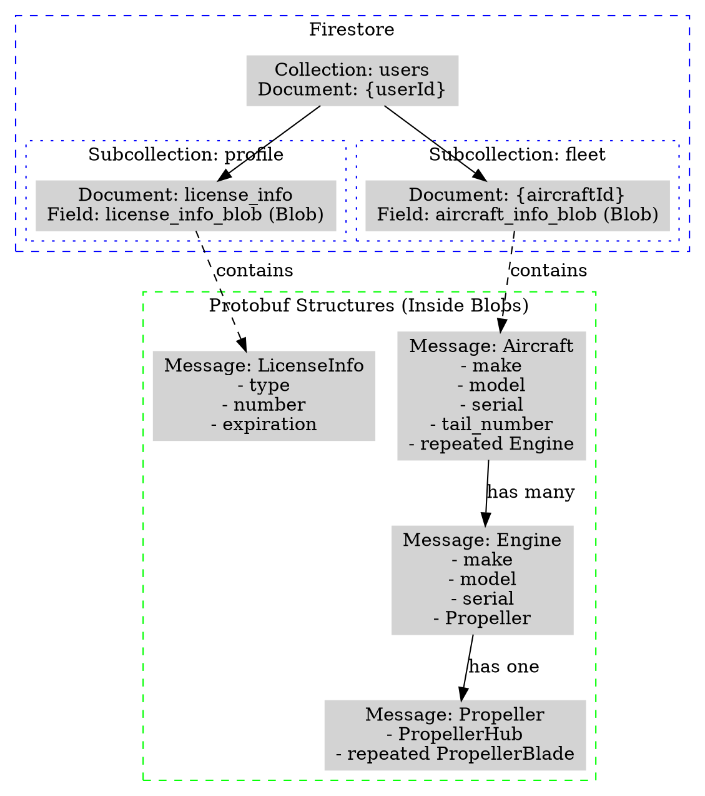
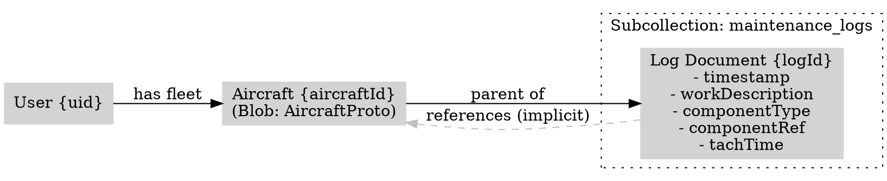

# Database Schema Design

## Overview
This document outlines the current database schema and the proposed expansion to support maintenance logs.

## Current Schema

The application uses **Firebase Firestore** as the primary database.
Data is primarily stored as **Protocol Buffer (Protobuf)** messages serialized into binary **Blobs** within Firestore documents.

### Collections Structure

1.  **Users Collection**: `users/{userId}`
    *   **Profile Subcollection**: `users/{userId}/profile/license_info`
        *   Stores user license details.
        *   **Fields**:
            *   `license_info_blob`: Blob (Serialized `LicenseInfo` proto)

2.  **Fleet Collection**: `users/{userId}/fleet/{aircraftId}`
    *   Stores aircraft configurations.
    *   **Fields**:
        *   `aircraft_info_blob`: Blob (Serialized `Aircraft` proto)

### Protobuf Definitions

*   **Aircraft**: Contains `make`, `model`, `serial`, `tail_number`, and a list of `Engine`s.
*   **Engine**: Contains `make`, `model`, `serial` and a `Propeller`.
*   **Propeller**: Contains `PropellerHub` and list of `PropellerBlade`.

### Current Schema Diagram (Graphviz)



## Proposed Schema Expansion: Maintenance Logs

We will add a new subcollection for maintenance logs under each aircraft. This ensures logs are logically grouped with the aircraft they belong to.

### New Subcollection: `maintenance_logs`

*   **Path**: `users/{userId}/fleet/{aircraftId}/maintenance_logs/{logId}`
*   **Storage Format**: Document fields (Native Firestore fields) + optional Blob for complex data if needed.
    *   *Decision*: Using native Firestore fields for high-level queryable data (Date, Component Type) and potential Blob for detailed content if the structure becomes complex, but for now flat fields are preferred for querying/filtering.

### Log Entry Structure

Each document in `maintenance_logs` will represent a single maintenance action.

#### Fields

| Field Name | Type | Description |
| :--- | :--- | :--- |
| `timestamp` | Timestamp | Date and time the work was performed. |
| `technicianId` | String | ID of the user who performed the work (default: current user). |
| `workDescription` | String | Detailed description of the work performed. |
| `componentType` | String (Enum) | `AIRFRAME`, `ENGINE`, `PROPELLER`, `APPLIANCE` |
| `componentId` | String | Serial Number of the specific component or "N/A" for Airframe. |
| `componentReference` | Map/Object | Redundant/Helper to easily identify context: `{ type: "ENGINE", position: 1, serial: "..." }` |
| `inspectionStatus` | String | E.g., `ANNUAL`, `100_HR`, `ELT_CHECK`, `AD_COMPLIANCE`, `SB_COMPLIANCE`, `ROUTINE`. |
| `tachTime` | Double | Aircraft Tach time at the moment of entry. |
| `attachments` | List<String> | List of URLs/paths to files in Firebase Storage (Photos, PDFs). |

### Relationships

*   **Aircraft Link**: Implicit via parent collection path `.../fleet/{aircraftId}/...`.
*   **Component Link**:
    *   **Engine**: Linked via `componentId` matching an Engine Serial Number in the `Aircraft` blob.
    *   **Propeller**: Linked via `componentId` matching a Propeller Hub Serial Number in the `Aircraft` blob.
    *   **Propeller Blade**: Linked via `componentId` matching a Blade Serial Number.

### Diagram with Maintenance Logs



### Component Reference Logic

Since components (Engines/Props) are nested inside the `Aircraft` blob, the Log Entry must store enough info to unambiguously point to the correct component, even if the configuration changes (e.g. engine swap).

*   **Store Serial Number**: This is the primary key for physical components.
*   **Validation**: When creating a log, the UI should verify the Serial Number exists in the current `Aircraft` snapshot.

### Protobuf Definition for Log Entry

If we decide to store the detailed log content as a Blob for consistency (though querying top-level fields is recommended for the list view):

```protobuf
message MaintenanceLog {
  string id = 1;
  google.protobuf.Timestamp timestamp = 2;
  string technician_id = 3;
  string work_description = 4;
  
  enum ComponentType {
    UNKNOWN = 0;
    AIRFRAME = 1;
    ENGINE = 2;
    PROPELLER = 3;
  }
  ComponentType component_type = 5;
  
  string component_serial = 6; // References Engine/Prop/Blade Serial
  
  string inspection_status = 7; // Could be enum or string
  
  double tach_time = 8;
  
  repeated string attachment_urls = 9;
}
```

We can create a hybrid approach:
1.  **Indexable Fields (Doc Fields)**: `timestamp`, `component_type`, `tach_time` (for sorting and filtering).
2.  **Blob Field**: `log_data_blob` containing the full `MaintenanceLog` proto (for strict typing and detailed fields).
